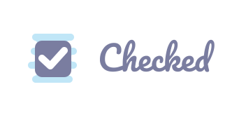

# react-input-checkbox



`Checkbox` is React component for boolean values. It accept a single boolean value. 
It has no additional styles by default, but it easy to stylize for your needs.

## Demo

Check it live on [CodePen](https://codepen.io/justredpaul/full/mdbqOor)

To run demo locally install dev dependencies by `npm install` and use `npm run demo`.

Parcel start demo on `http://localhost:1234/`.

## Table of Contents

1. [Installation](#installation)
2. [Usage](#usage)
    1. [Example](#example)
    2. [Props](#props)
    2. [Style template](#style-template)
3. [License](#license)

## Installation

`npm install react-input-checkbox --save`

## Usage

### Example

```jsx
import { Checkbox } from 'react-input-checkbox';

// Import for using theme - contains base styles which will hide native checkbox and etc.
import "../node_modules/react-input-checkbox/lib/react-input-checkbox.min.css";

<Checkbox>Option #1</Checkbox>
<Checkbox disabled>Option #2</Checkbox>
<Checkbox value={true}>Option #3</Checkbox>
<Checkbox theme="fancy">Fancy Option #4</Checkbox>
```

### Props

#### `children`: `React.ReactNode`

Node that will be placed near checkbox as a label.


#### `disabled` : `Boolean`

`Optional`, default value is `false`

Flag for making checkbox disabled.


#### `indeterminate` : `Boolean`

`Optional`, default value is `false`

Visual only state of checkbox which is still either checked or unchecked as a state.
If you want tot use it, you must create visual styles for that state, 
because it is not provided by default.


#### `onChange` : `(event: SyntheticEvent) => void`

Callback which will be called any time the input value changes.


#### `theme`: `String`

`Optional`, default value is `null`

Class name prefix for your css styles for checkbox


#### `value`: `Boolean`

A value for the checkbox.

### Style template

You can use any styles to checkboxes. Here is simple CSS template, that you can copy and paste
to your project, just replace `%your_style_prefix%` with prefix that you will pass to `theme` prop:

```
.%your_style_prefix% {
    // Common styles for the checkbox
    // Most likely you will customize left padding here
}
.%your_style_prefix%__image {
    // Default state of the checkbox image
    // Right place to size, background-image of unchecked state
}
.%your_style_prefix%__label {
    // Label styles (font styles mostly)
}

// Some states of checkbox image
.%your_style_prefix%__input:focus + .%your_style_prefix%__image {
    // Focused and unchecked
}
.%your_style_prefix%__input:disabled + .%your_style_prefix%__image {
    // Disabled and unchecked
}
.%your_style_prefix%__input:checked + .%your_style_prefix%__image {
    // Checked
}
.%your_style_prefix%__input:checked:focus + .%your_style_prefix%__image {
    // Focused and checked
}
.%your_style_prefix%__input:checked:disabled + .%your_style_prefix%__image {
    // Disabled and checked
}

// Additional indeterminate states
.%your_style_prefix%__input_indeterminate + .%your_style_prefix%__image {
    // Marks as indeterminate
}
.%your_style_prefix%__input_indeterminate:focus + .%your_style_prefix%__image {
    // Indeterminate and focused
}
.%your_style_prefix%__input_indeterminate:disabled + .%your_style_prefix%__image {
    // Indeterminate and disabled
}

``` 

Check out demo styles for examples of styles: [fancy-checkbox](demo/fancy-theme.css) and [bootstrap-checkbox](demo/bootstrap-theme.css)

## License

Copyright (c) 2019 Paul Popov. MIT License.